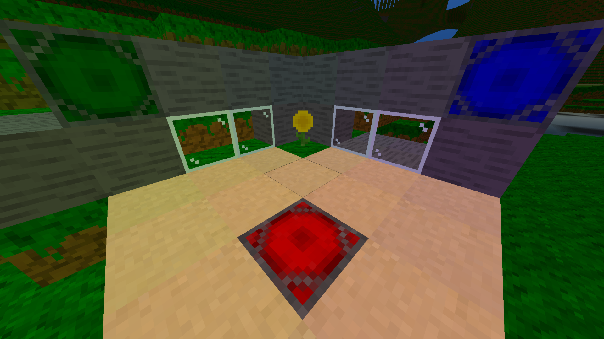

# OmniVoxel v0.8.3-alpha

OmniVoxel is a voxel game-engine developed by CaptainEterk, written in Java.



# Features
## Multiplayer

Multiplayer is a core component to OmniVoxel. Players can join servers and see other players and their modifications to the world.

## Modding

OmniVoxel is a voxel game-engine. Anyone can create a game in it. Games are currently only written in JSON, although I do plan to add Lua support eventually. The benefit to a JSON-based approach is a node-based engine. Lua scripts are only for actions that are unable to be performed in JSON.

## Performance

Optimization is a fundamental part of OmniVoxel. As of right now, there are some major optimizations I can still implement, and as features are created, performance will drop.

### Specs:
**OS:** Linux 7.1.4-arch1-1<br>
**WM:** Hyprland 0.56.2 (Wayland)<br>
**CPU:** i7-8700k (12) 4.7 GHz<br>
**GPU:** AMD Radeon RX 6600<br>
**Memory:** 64 Gib DDR4<br>

*Benchmark settings*
```
width=750
height=750
render_distance=512
render_scale=1.2
render_filter=linear
sensitivity=2f
frustum_bias=10
shader=default
ambient_occlusion=false
smooth_lighting=false
vsync=false
free_chunk_max=1000
lod_block_limit=128
max_mesh_generator_threads=12
max_lighting_generator_threads=12
bufferize_chunks_per_frame=10
```

**FPS (loading):** 60-240<br>
**FPS (loaded):** 240<br>
**Memory Usage (client):** 1.2 Gb<br>
**Memory Usage (server):** 20 Mb<br>
**Memory Usage (GPU):** 400 Mb<br>
**Total loading time (pre-generated):** 1m 54s<br>
**Total loading time (runtime-generated):** 3m 9s<br>